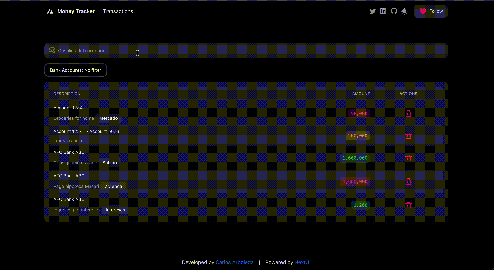

# AI Money Tracker

Showcase the power of Gen AI by generating transactions entries from text inputs.

[View Demo](https://ai-money-tracker-h1xtt6h4d-carlos-arboledas-projects-990f3974.vercel.app/)



[Features](docs/FEATURES.md)

## Technologies Used

- [Next.js 13](https://nextjs.org/docs/getting-started)
- [NextUI v2](https://nextui.org/)
- [Tailwind CSS](https://tailwindcss.com/)
- [Tailwind Variants](https://tailwind-variants.org)
- [TypeScript](https://www.typescriptlang.org/)
- [Framer Motion](https://www.framer.com/motion/)
- [next-themes](https://github.com/pacocoursey/next-themes)
- [Vercel KV](https://vercel.com/docs/storage/vercel-kv)

## Resources
- [React SVG Icons](https://reactsvgicons.com/search)
- [react-placeholder-typing](https://github.com/pashanitw/react-placeholder-typing/tree/master)
- [Rate Limiting](https://vercel.com/guides/rate-limiting-edge-middleware-vercel-kv)

## How to Use


### Use the template with create-next-app

To create a new project based on this template using `create-next-app`, run the following command:

```bash
npx create-next-app -e https://github.com/nextui-org/next-app-template
```

### Install dependencies

```bash
npm install
```

### Run the development server

```bash
npm run dev
```

## License

Licensed under the [MIT license](https://github.com/nextui-org/next-app-template/blob/main/LICENSE).