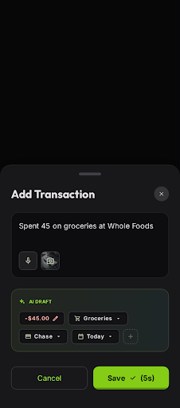
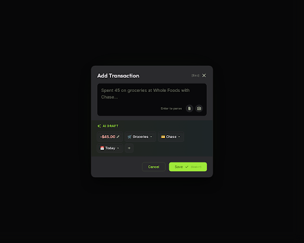

# Software Design Document (SDD): AI Draft Transaction Pipeline

**Document Version:** 1.1.0  
**Status:** Approved for Implementation  
**Target Milestone:** Phase 3 Scope (Refined AI Draft Pipeline)  
**Related Specs:** `sdd/ux-redesing-v2.md`, `sdd/heroui-v3-migration.md`, `sdd/offline-first-caching.md`  
**Reference Mockup:** `Zolvent V2 - Mobile AI Transaction Entry`  

---

## 1. Executive Summary & Objective

The **AI Draft Transaction Pipeline** is the core transaction creation mechanism for Zolvent V2. It replaces static multi-step forms with a **lightning-fast, multimodal natural language drafting interface**. Users can type a quick statement (e.g. *"Spent 45 on groceries at Whole Foods with Chase"*) or upload a receipt photo; the system extracts the structured fields (Amount, Description, Category, Account, Date/Time, Type) and presents them as **interactive, badged inline-editable chips**.

### Core Goals
1. **Frictionless Entry:** Reduce time-to-log an expense from ~20 seconds to under 3 seconds.
2. **Unified Responsive Modal:** Use a single HeroUI `<Modal>` component with adaptive placement (`placement="bottom"` on mobile, `placement="center"` on desktop) to share 100% of component logic and styles across form factors.
3. **Domain Type Reuse:** Leverage existing domain enums (`TransactionType`, `TransactionStatus`) across the AI schema, API contracts, Zustand store, and UI components.
4. **Tactile Inline Chip Editing:** Allow instant correction of any drafted field (Amount, Type, Category, Account, Date & Time) by morphing badged chips directly into inline input/select controls.
5. **Smart Auto-Confirm with Undo:** For high-confidence AI parses ($\ge 0.85$), provide an animated 5-second countdown inside the primary CTA with instant pause/manual override upon any user interaction.
6. **Meaningful Error Feedback:** Provide structured backend error diagnostics and present actionable inline error alerts in the UI.
7. **Strict Offline Guard:** Ensure zero transaction creation occurs while offline (only data visualization is permitted until connectivity is restored).

---

## 2. User Experience & Visual Design System

### 2.1 Visual Styling & Theme Tokens

Following the Zolvent V2 design system:
- **Surface Background:** Matte dark slate / zinc (`#121214` / `bg-zinc-950`).
- **Modal Container:** `bg-zinc-900/95 backdrop-blur-md border border-zinc-800/80 rounded-t-3xl md:rounded-2xl shadow-2xl`.
- **Primary Brand Accent:** Vibrant Lime Green (`#a3e635` / `#84cc16` / `text-lime-400`, `bg-lime-500`, `border-lime-500/50`).
- **AI Sparkle Tag:** `#84cc16` text badge with subtle glow and `IconSparkles`.
- **Badged Chips Style:** `bg-zinc-800/80 hover:bg-zinc-700/80 border border-zinc-700 text-zinc-100 rounded-xl px-3 py-1.5 text-xs font-medium transition-all cursor-pointer select-none`.
- **Active / Editing Chip:** `border-lime-500 ring-1 ring-lime-500/50 bg-zinc-900`.
- **Expense Negative Pill:** `text-rose-400 font-semibold`.
- **Income Positive Pill:** `text-emerald-400 font-semibold`.

---

### 2.2 Responsive Form Factors & UI Previews (Mobile vs Desktop)

> **Stitch Project:** `Zolvent V2 - AI Draft Transaction Pipeline` (`projects/16560526308918892067`)

| Mobile PWA (`placement="bottom"`) | Desktop Dialog (`placement="center"`) |
| :---: | :---: |
|  |  |
| *Mobile Viewport: Modal anchored to bottom with safe-area padding & receipt camera capture* | *Desktop Viewport: Centered modal with keyboard shortcuts ([Esc], [Cmd+↵])* |

```
┌─────────────────────────────────────────────────────────────┐
│ MOBILE (PWA Viewport < 768px -> Modal placement="bottom")  │
│                                                             │
│  ┌───────────────────────────────────────────────────────┐  │
│  │                    [ Drag Handle ]                    │  │
│  │  Add Transaction                                  ✕   │  │
│  │ ┌───────────────────────────────────────────────────┐ │  │
│  │ │ Type or snap receipt... e.g. "45 groceries"       │ │  │
│  │ │                                      [ 📷 Camera] │ │  │
│  │ └───────────────────────────────────────────────────┘ │  │
│  │  ✨ AI DRAFT                                           │  │
│  │  Whole Foods Groceries ✏️  (Click to edit title)       │  │
│  │  [ -$45.00 ✏️ ] [ 🏷️ Expense ▾ ] [ 🛒 Groceries ▾ ]     │  │
│  │  [ 💳 Chase ▾ ] [ 📅 Today 10:30 PM ▾ ]                 │  │
│  │ ┌───────────────────┐ ┌─────────────────────────────┐ │  │
│  │ │      Cancel       │ │       Save ✓ (5s ▓▓▓░)      │ │  │
│  │ └───────────────────┘ └─────────────────────────────┘ │  │
│  └───────────────────────────────────────────────────────┘  │
│  (Anchored to bottom safe area)                             │
└─────────────────────────────────────────────────────────────┘

┌─────────────────────────────────────────────────────────────┐
│ DESKTOP (Viewport ≥ 768px -> Modal placement="center")      │
│                                                             │
│     ┌─────────────────────────────────────────────────┐     │
│     │  Add Transaction (Esc to close)             ✕   │     │
│     │ ┌─────────────────────────────────────────────┐ │     │
│     │ │ Type prompt or drop receipt image...        │ │     │
│     │ │                                    [📷 Drop]│ │     │
│     │ └─────────────────────────────────────────────┘ │     │
│     │  ✨ AI DRAFT                                     │     │
│     │  Whole Foods Groceries ✏️  (Click to edit title) │     │
│     │  [ -$45.00 ✏️ ] [ 🏷️ Expense ▾ ] [ 🛒 Groceries ▾ ] │ │
│     │  [ 💳 Chase ▾ ] [ 📅 Today 10:30 PM ▾ ]         │     │
│     │ ┌───────────────────┐ ┌───────────────────────┐ │     │
│     │ │      Cancel       │ │     Save ✓ (Cmd+↵)    │ │     │
│     │ └───────────────────┘ └───────────────────────┘ │     │
│     └─────────────────────────────────────────────────┘     │
│     (Centered Modal with backdrop-blur and keyboard trap)   │
└─────────────────────────────────────────────────────────────┘
```

#### Unified Modal Implementation Strategy
- Built with HeroUI v3 `<Modal placement={isMobile ? "bottom" : "center"}>`.
- On mobile: appears as a bottom sheet anchored to the bottom with rounded top corners (`rounded-t-3xl`), drag handle, and `env(safe-area-inset-bottom)` padding.
- On desktop: appears as a centered dialog with backdrop blur (`backdrop-blur-sm`).

---

### 2.3 Multimodal Input Specification

1. **Natural Language Text:**
   - Multi-line autosizing textarea with animated placeholder hints (e.g. *"Spent 45 on groceries at Whole Foods with Chase"*).
   - Enter key triggers AI draft parsing; `Shift+Enter` creates a new line.
2. **Camera & Receipt Image Scanning:**
   - Camera button with hidden native file input: `<input type="file" accept="image/*" capture="environment">`.
   - On Desktop: Supports file picker or direct drag-and-drop of receipt images.
   - On Selection: Generates an instant local thumbnail preview with a removal button (`✕`), displays a scanning spinner, and sends base64 image data to `POST /api/transaction/parse`.

---

### 2.4 Interactive Badged Chips & Inline Description Editing

The AI Draft section separates the **Transaction Description Title** from the **Metadata Badged Chips**:

#### 1. Inline Editable Description Title (`<InlineDescriptionTitle>`):
- Displayed immediately below `✨ AI DRAFT`.
- Displays the concise extracted merchant/purchase summary (e.g. `"Whole Foods Groceries ✏️"`).
- Clicking or focusing it morphs it into a clean, borderless inline text input auto-focused, allowing the user to modify the transaction description directly without touching the original natural language prompt.

#### 2. Interactive Badged Chips:
Every drafted metadata field is an **interactive badged chip** that morphs inline into an active editor when tapped or focused. The layout dynamically adapts based on the active `TransactionType`:

- **For Expense / Income:** `[ -$45.00 ✏️ ] [ 🏷️ Expense ▾ ] [ 🛒 Groceries ▾ ] [ 💳 Chase ▾ ] [ 📅 Today, 10:30 PM ▾ ]`
- **For Transfers:** `[ $200.00 ✏️ ] [ 🏷️ Transfer ▾ ] [ 📤 From: Chase ▾ ] [ 📥 To: Savings ▾ ] [ 📅 Today, 10:30 PM ▾ ]`

| Field / Chip | Display State (Default) | Inline Edit State (Active) | Context / Commit Trigger |
|---|---|---|---|
| **Description Title** | `Whole Foods Groceries ✏️` | Inline text input with auto-focus | `Enter`, `Tab`, or Click outside (blur) |
| **Amount** | `-$45.00 ✏️` (Rose for expense, Green for income, Cyan for transfer) | Inline numeric text input `$ [ 45.00 ]` with auto-focus | `Enter`, `Tab`, or Click outside (blur) |
| **Type** | `🏷️ Expense ▾` / `🏷️ Income ▾` / `🏷️ Transfer ▾` | Inline toggle dropdown between `TransactionType` enums | Selection adapts the chips row (reveals Destination Account on Transfer) |
| **Category** | `🛒 Groceries ▾` (Category icon + name) | Compact inline searchable select dropdown with category list & emoji | Displayed for Expense/Income. Hidden/Optional for Transfers |
| **Source Account** | `💳 Chase ▾` *(Expense/Income)* or `📤 From: Chase ▾` *(Transfer)* | Compact inline dropdown listing user's active accounts & current balances | Option selection or `Enter` |
| **Destination Account** | `📥 To: Savings ▾` *(Transfer)* or `📥 To: Select Account ▾` | Compact inline dropdown listing accounts (excluding Source Account) | Active for Transfers. Option selection or `Enter` |
| **Date & Time** | `📅 Today, 10:30 PM ▾` / `📅 Aug 20, 2:15 PM ▾` | Popover with Date picker (Today / Yesterday / Custom) + Time picker (`HH:mm`) | Option selection or change |

---

### 2.5 Quick Auto-Confirm & Countdown Save CTA

1. **Confidence Threshold:** If the AI parse returns `confidence >= 0.85`, the draft enters **Auto-Confirm Mode**.
2. **Progress Animation:** A 5-second horizontal neon green progress bar animates across the "Save" button with label: `Save ✓ (5s)`.
3. **User Pause / Override:**
   - Tapping/editing any chip, modifying the text prompt, or clicking the progress bar **immediately pauses and cancels** the countdown, converting the button to regular manual `Save ✓`.
4. **Manual Commit:** Clicking `Save ✓` (or pressing `Cmd+Enter` on desktop) immediately saves without waiting for the timer.
5. **Cancel Action:** Clicking `Cancel` or pressing `Escape` clears the draft and closes the modal.

---

## 3. Backend Architecture & API Decoupling

### 3.1 Motivation & Decoupling Strategy

Previously, `POST /api/transaction` accepted `multipart/form-data` and internally combined AI extraction with database persistence via `GenerateTransactionService`. This coupled the AI parser to database writes, preventing users from reviewing, editing, or canceling drafted transactions before saving.

**The Refactored Architecture Decouples These Concerns Completely:**
1. **Extraction (`POST /api/transaction/parse`):** A stateless, read-only GenAI extraction endpoint that takes natural language text or receipt photos, parses structured attributes, computes a confidence score, and resolves category/account references without touching the database.
2. **Creation (`POST /api/transaction`):** A standard RESTful JSON endpoint that validates and persists the finalized `CreateTransactionInput` directly to Firestore via `CreateTransactionService`, updating account balances and emitting pub/sub domain events.

```
                  ┌────────────────────────────────────────┐
                  │   User Input (Text / Receipt Photo)    │
                  └──────────────────┬─────────────────────┘
                                     │
                                     ▼
                     POST /api/transaction/parse
                    (Stateless GenAI Extraction)
                                     │
                                     ▼
                   ParseTransactionDraftResponse DTO
                  { amount, type, category, account, ... }
                                     │
                                     ▼
                     Loaded into Transient Store
                    (User reviews & edits chips)
                                     │
                                     ▼
                     POST /api/transaction (JSON)
                    (Direct Persistence & PubSub)
                                     │
                                     ▼
                         Firestore DB + Events
```

---

### 3.2 Backend API Contracts & Schemas

#### 1. Domain Enums & Models
Directly reused from `@/app/api/domain/transaction/model/transaction.model`:
```typescript
export enum TransactionType {
  INCOME = "income",
  EXPENSE = "expense",
  TRANSFER = "transfer",
}

export enum TransactionStatus {
  PENDING = "pending",
  COMPLETE = "complete",
}
```

---

#### 2. `POST /api/transaction/parse` (New Stateless Extraction Endpoint)
- **Route Handler:** `src/app/api/(routes)/transaction/parse/route.ts`
- **Request Headers:** `Content-Type: multipart/form-data` OR `Content-Type: application/json`
- **Request Payload:**
  ```typescript
  export interface ParseTransactionDraftRequest {
    text?: string;       // Natural language prompt
    picture?: string;    // Base64 encoded receipt image or file
  }
  ```
- **Response (200 OK):**
  ```typescript
  export interface ParseTransactionDraftResponse {
    amount: number;
    type: TransactionType;
    categoryRef: string;
    sourceAccountRef: string;
    destinationAccountRef?: string;
    description: string;
    createdAt: string; // ISO 8601 string (includes date and time; defaults to current time if unparsed)
    confidence: number; // 0.00 to 1.00 score
  }
  ```
- **Meaningful Error Responses:**
  - `400 Bad Request`:
    ```json
    {
      "message": "Missing required transaction information. Please provide an amount or description.",
      "code": "MISSING_INPUT_FIELDS",
      "missingFields": ["amount", "description"]
    }
    ```
  - `422 Unprocessable Content`:
    ```json
    {
      "message": "AI could not recognize transaction details from the provided input. Please enter values manually.",
      "code": "UNPARSEABLE_DRAFT"
    }
    ```

---

#### 3. `POST /api/transaction` (Refactored JSON Persistence Endpoint)
- **Route Handler:** `src/app/api/(routes)/transaction/route.ts`
- **Request Headers:** `Content-Type: application/json`
- **Request Body (`CreateTransactionInput`):**
  ```typescript
  export interface CreateTransactionPayload {
    description: string;
    amount: number;
    type: TransactionType;
    status: TransactionStatus;
    sourceAccount: string;
    destinationAccount?: string;
    category?: string;
    paymentLink?: string;
    createdAt: string; // ISO 8601 string or Date
    isRecurrent?: boolean;
  }
  ```
- **Response (200 OK):**
  ```json
  {
    "id": "trans_123456789"
  }
  ```
- **Domain Service Delegation:**
  ```typescript
  export async function POST(req: NextRequest) {
    return withUserContext(req, async () => {
      const createTransactionService = api.resolve(CreateTransactionService);
      const body = (await req.json()) as CreateTransactionPayload;

      try {
        const id = await createTransactionService.execute({
          ...body,
          createdAt: body.createdAt ? new Date(body.createdAt) : new Date(),
          status: body.status ?? TransactionStatus.COMPLETE,
        });

        return NextResponse.json({ id }, { status: 200 });
      } catch (error) {
        const domainError = error as DomainError<unknown>;
        return NextResponse.json(
          { message: domainError.message, code: domainError.name },
          { status: domainError.statusCode ?? 400 }
        );
      }
    });
  }
  ```

---

### 3.3 Genkit AI Schema & In-Place Prompt Refactoring

#### 1. Genkit Extraction Schema
**Location:** `src/app/api/drivers/genai/genkit/schemas/parse.transaction.schema.ts`

```typescript
import { z } from "genkit";
import { TransactionType } from "@/app/api/domain/transaction/model/transaction.model";

export const ParseTransactionDataSchema = z.object({
  description: z.string().describe("Concise summary of transaction/merchant (max 100 chars)"),
  amount: z.number().describe("Transaction amount in local currency (positive number)"),
  type: z.nativeEnum(TransactionType).describe("Transaction type: income, expense, or transfer"),
  category: z.string().describe("Category reference ID matching user's categories list"),
  sourceAccount: z.string().describe("Source account reference ID matching user's accounts list"),
  destinationAccount: z.string().optional().describe("Destination account reference ID for transfers"),
  createdAt: z.string().optional().describe("Date and time in ISO format yyyy-MM-dd'T'HH:mm"),
  confidence: z.number().min(0).max(1).describe("AI confidence score between 0.0 and 1.0"),
});

export const ParseTransactionInputSchema = z.object({
  categories: z.array(
    z.object({
      ref: z.string(),
      name: z.string().optional(),
      description: z.string().optional(),
    })
  ),
  accounts: z.array(
    z.object({
      ref: z.string(),
      name: z.string(),
      type: z.string().optional(),
      description: z.string().optional(),
    })
  ),
  text: z.string().optional(),
  picture: z.string().optional(),
});

export const ParseTransactionOutputSchema = z.object({
  type: z.enum(["success", "error"]),
  data: ParseTransactionDataSchema.optional(),
  error: z.object({ error: z.string() }).optional(),
});

export type ParseTransactionDataType = z.infer<typeof ParseTransactionDataSchema>;
export type ParseTransactionInputType = z.infer<typeof ParseTransactionInputSchema>;
```

#### 2. Prompt Refactoring (`prompts/extractTransactionData.prompt`)
Refactor the prompt in-place to accept both `categories` and `accounts`, ensuring the AI accurately maps natural account names (e.g. "Chase", "Nu", "Savings") to user account refs:

```handlebars
---
model: googleai/gemini-2.0-flash
config:
  temperature: 0
input:
  schema: ParseTransactionInputSchema
output:
  schema: ParseTransactionOutputSchema
---

{{role "system"}}
You are an expert financial assistant that parses natural language transaction prompts and receipt images into structured JSON objects.

Guidelines:
1. Extract the transaction amount (numeric positive value in COP/local currency).
2. Infer the transaction type:
   - 'expense' for purchases, bills, shopping, food.
   - 'income' for deposits, salary, dividends, refunds.
   - 'transfer' for movements between user accounts (must specify source and destination).
3. Generate a clean, concise description summarizing the merchant or item (max 100 chars). Do NOT include account names in the description.
4. Category must match one of the following category references:
{{#each categories}}
  - {{this.ref}}: {{this.name}} ({{this.description}})
{{/each}}
5. Source and Destination accounts must match one of the following account references:
{{#each accounts}}
  - {{this.ref}}: {{this.name}} - {{this.type}} ({{this.description}})
{{/each}}
6. Compute a confidence score from 0.0 to 1.0 based on how unambiguously the input matches the categories and accounts.

{{role "user"}}
{{#if text}}
  {{text}}
{{/if}}
{{#if picture}}
  {{media url=picture}}
{{/if}}
```

---

### 3.4 Domain Service Architecture

`ParseTransactionDraftService` injects both `GetAllCategoriesService` and `GetAllAccountsService` to feed active contextual data into the prompt:

```typescript
@Injectable()
export class ParseTransactionDraftService implements Service<ParseTransactionInputDTO, ParseTransactionDraftResponse> {
  constructor(
    private readonly getAllCategoriesService: GetAllCategoriesService,
    private readonly getAllAccountsService: GetAllAccountsService,
    @Inject("GenAIService")
    private readonly genAIService: GenAIService
  ) {}

  async execute(input: ParseTransactionInputDTO): Promise<ParseTransactionDraftResponse> {
    const [categories, accounts] = await Promise.all([
      this.getAllCategoriesService.execute(),
      this.getAllAccountsService.execute(),
    ]);

    const result = await this.genAIService.extractData(categories, accounts, input.text, input.picture);
    if (!result || result.error) {
      throw new DomainError(result?.error ?? "Unable to extract transaction details", 422);
    }
    return result.data;
  }
}
```

---

## 4. Frontend Component Design (React 19 + HeroUI v3)

### 4.1 Component Tree Hierarchy

```
<AddTransactionModal> (HeroUI Modal with placement={isMobile ? "bottom" : "center"})
  │
  ├── <ModalHeader>
  │     ├── DragHandleBar (Mobile only)
  │     ├── Title: "Add Transaction"
  │     └── CloseButton (✕)
  │
  ├── <ModalBody>
  │     ├── <OfflineWarningBanner> (Rendered if offline: creation disabled)
  │     ├── <ParseErrorAlert> (Rendered if parse returns meaningful error)
  │     │
  │     ├── <MultimodalDraftInput>
  │     │     ├── <TextArea> (Natural Language Prompt)
  │     │     ├── <ReceiptCameraTrigger> (Camera icon + file input + photo thumbnail)
  │     │     └── <ParseLoadingIndicator> (Animated skeleton / sparkles)
  │     │
  │     └── <DraftPreviewSection>
  │           ├── <DraftHeaderBadge> (✨ AI DRAFT indicator)
  │           ├── <InlineDescriptionTitle> (Editable summary title: "Whole Foods Groceries ✏️")
  │           └── <DraftChipsGroup>
  │                 ├── <InlineAmountChip> (Morphs to Currency Input)
  │                 ├── <InlineTypeChip> (Morphs to TransactionType toggle: Expense/Income/Transfer)
  │                 ├── <InlineCategoryChip> (Rendered for Expense/Income: Category dropdown)
  │                 ├── <InlineAccountChip role="source"> (Morphs to Source Account Dropdown)
  │                 ├── <InlineAccountChip role="destination"> (Rendered for Transfer: Destination Account Dropdown)
  │                 └── <InlineDateTimeChip> (Morphs to Date + Time Picker Popover)
  │
  └── <ModalFooter>
        ├── <CancelButton> ("Cancel")
        └── <AutoConfirmSaveButton> ("Save ✓" with 5s countdown progress bar)
```

---

### 4.2 Detailed Component Breakdown

All draft modal components are co-located in `src/components/features/Transactions/AddTransactionModal/`:

#### 1. `AddTransactionModal.tsx`
- **File:** `src/components/features/Transactions/AddTransactionModal/AddTransactionModal.tsx`
- **Props:**
  ```typescript
  export interface AddTransactionModalProps {
    isOpen: boolean;
    onClose: () => void;
  }
  ```
- **Behavior:**
  - Detects screen breakpoint via media query hook (`useIsMobile()`).
  - Sets `placement={isMobile ? "bottom" : "center"}`.
  - Traps keyboard shortcuts (`Escape` to close, `Cmd+Enter` to save).

#### 2. `InlineDescriptionTitle.tsx`
- **File:** `src/components/features/Transactions/AddTransactionModal/InlineDescriptionTitle.tsx`
- **Props:**
  ```typescript
  export interface InlineDescriptionTitleProps {
    description: string;
    onDescriptionChange: (description: string) => void;
    onInteraction: () => void;
  }
  ```
- **Behavior:**
  - In display mode: Renders concise title (e.g. `"Whole Foods Groceries ✏️"`) with edit pencil on hover.
  - In edit mode: Renders an auto-focused borderless `<input type="text">` styled as a headline. Saves on Enter or blur.

#### 3. `InlineAccountChip.tsx` (Supports Source & Destination)
- **File:** `src/components/features/Transactions/AddTransactionModal/chips/InlineAccountChip.tsx`
- **Props:**
  ```typescript
  export interface InlineAccountChipProps {
    role: "source" | "destination";
    accountRef: string;
    excludedAccountRef?: string; // Excludes matching account to prevent transferring to itself
    onAccountChange: (accountRef: string) => void;
    onInteraction: () => void;
  }
  ```
- **Behavior:**
  - When `role="source"`: Displays `💳 Chase ▾` (or `📤 From: Chase ▾` in Transfer mode).
  - When `role="destination"`: Displays `📥 To: Savings ▾` (or `📥 To: Select Account ▾` if empty).
  - Tapping opens the compact account selector popover displaying active accounts, icons, and balances (with `excludedAccountRef` filtered out).

#### 4. `InlineCategoryChip.tsx`
- **File:** `src/components/features/Transactions/AddTransactionModal/chips/InlineCategoryChip.tsx`
- **Props:**
  ```typescript
  export interface InlineCategoryChipProps {
    categoryRef: string;
    onCategoryChange: (categoryRef: string) => void;
    onInteraction: () => void;
  }
  ```

#### 5. `InlineTypeChip.tsx`
- **File:** `src/components/features/Transactions/AddTransactionModal/chips/InlineTypeChip.tsx`
- **Props:**
  ```typescript
  export interface InlineTypeChipProps {
    type: TransactionType;
    onTypeChange: (type: TransactionType) => void;
    onInteraction: () => void;
  }
  ```
- **Behavior:**
  - Displays badge with icon: `🏷️ Expense ▾`, `🏷️ Income ▾`, or `🏷️ Transfer ▾`.
  - Tapping opens a fast 3-item select dropdown to toggle type.
  - Switching to `TransactionType.TRANSFER` dynamically displays the Destination Account chip.

#### 6. `InlineDateTimeChip.tsx`
- **File:** `src/components/features/Transactions/AddTransactionModal/chips/InlineDateTimeChip.tsx`
- **Props:**
  ```typescript
  export interface InlineDateTimeChipProps {
    date: Date;
    onDateChange: (date: Date) => void;
    onInteraction: () => void;
  }
  ```
- **Behavior:**
  - Displays humanized date and time: e.g. `"📅 Today, 10:30 PM ▾"` or `"📅 Aug 20, 2:15 PM ▾"`.
  - Tapping opens an inline popover containing:
    1. Quick date pills (`Today`, `Yesterday`, `Custom Date Input`).
    2. Time input (`<input type="time">`) defaulting to current time if AI did not provide explicit time.

#### 7. `InlineAmountChip.tsx`
- **File:** `src/components/features/Transactions/AddTransactionModal/chips/InlineAmountChip.tsx`
- **Behavior:**
  - Display: `-$45.00 ✏️` (Expense), `+$45.00 ✏️` (Income), or `$200.00 ✏️` (Transfer).
  - Edit: Morphs to `<input type="number">` auto-focused.

#### 8. `MultimodalDraftInput.tsx`
- **File:** `src/components/features/Transactions/AddTransactionModal/MultimodalDraftInput.tsx`

#### 9. `AutoConfirmSaveButton.tsx`
- **File:** `src/components/features/Transactions/AddTransactionModal/AutoConfirmSaveButton.tsx`
- **Behavior:**
  - Solid neon lime button with animated countdown layer for high-confidence drafts.
  - Pauses on user interaction; triggers instant mutation when clicked.
  - Disabled when offline or when required fields (like destination account for transfers) are missing.

---

## 5. Client State Management (Zustand Store)

**Location:** `src/stores/transaction-draft.store.ts`

```typescript
import { create } from "zustand";
import { TransactionType, TransactionStatus } from "@/app/api/domain/transaction/model/transaction.model";

export interface TransactionDraftState {
  // Modal Visibility
  isOpen: boolean;
  
  // Prompt & Multimodal inputs
  prompt: string;
  receiptImageBase64: string | null;
  receiptPreviewUrl: string | null;
  
  // Draft Data Fields (Reusing Domain Enums)
  description: string;
  amount: number;
  type: TransactionType;
  status: TransactionStatus;
  categoryRef: string;
  sourceAccountRef: string;
  destinationAccountRef: string | null;
  createdAt: Date; // Stores full Date and Time
  
  // Pipeline Status & Diagnostics
  pipelineStatus: "idle" | "parsing" | "drafted" | "saving" | "error";
  confidence: number;
  errorMessage: string | null;
  isAutoConfirmActive: boolean;
  autoConfirmCountdown: number; // 5 -> 0 seconds
  
  // Actions
  openDraftModal: (initialPrompt?: string) => void;
  closeDraftModal: () => void;
  setPrompt: (prompt: string) => void;
  setDescription: (description: string) => void;
  setReceiptImage: (base64: string | null, previewUrl: string | null) => void;
  updateDraftField: <K extends keyof TransactionDraftState>(key: K, value: TransactionDraftState[K]) => void;
  setParsedDraft: (draft: Partial<TransactionDraftState>, confidence: number) => void;
  setErrorMessage: (msg: string | null) => void;
  startAutoConfirm: () => void;
  cancelAutoConfirm: () => void;
  resetDraft: () => void;
}
```

---

## 6. Offline-First Guard & Diagnostics

Following the project's offline architecture:
1. **Zero Offline Creation Rule:**
   - **No transactions can be created while offline.** Only data visualization (cached reads) is supported when disconnected.
2. **UI Enforcement:**
   - `useOfflineWriteGuard()` (from `src/hooks/useOnlineStatus.ts`) guards save mutations.
   - When the user opens the modal while offline:
     - Textarea and inputs are disabled.
     - A clear offline banner is displayed: *"You are currently offline. Transaction creation is disabled until connection is restored."*
     - The Save button is disabled (`disabled={!isOnline}`).

---

## 7. Implementation Milestones

### Milestone 1: Backend Extraction Service & Decoupled Endpoints
- [ ] Create `src/app/api/drivers/genai/genkit/schemas/parse.transaction.schema.ts` using `TransactionType`.
- [ ] Refactor `prompts/extractTransactionData.prompt` in-place with `categories` and `accounts` contextual schemas.
- [ ] Update `GenkitService` to accept `accounts` alongside `categories` and return confidence ratings.
- [ ] Implement `ParseTransactionDraftService` in `src/app/api/domain/transaction/service/` injecting `GetAllCategoriesService` and `GetAllAccountsService`.
- [ ] Create Next.js Route Handler `POST /api/transaction/parse` with meaningful error responses.
- [ ] Refactor `POST /api/transaction` route handler to accept standard JSON `CreateTransactionPayload`.
- [ ] Write Jest unit tests for `ParseTransactionDraftService` and route handlers.

### Milestone 2: Transient Store & API Hooks
- [ ] Implement `src/stores/transaction-draft.store.ts`.
- [ ] Refactor `useMutateTransaction.ts` to send JSON `CreateTransactionPayload`.
- [ ] Implement mutation hook `useParseTransactionDraft.ts`.
- [ ] Implement auto-confirm countdown hook `useDraftAutoConfirm.ts`.

### Milestone 3: Morphing Chips, Description Title & Modal UI
- [ ] Build `InlineDescriptionTitle.tsx` for inline editing of transaction title.
- [ ] Build `InlineAmountChip.tsx`, `InlineTypeChip.tsx`, `InlineCategoryChip.tsx`, `InlineAccountChip.tsx`, `InlineDateTimeChip.tsx`.
- [ ] Build `DraftChipsGroup.tsx` and `AutoConfirmSaveButton.tsx`.
- [ ] Build `MultimodalDraftInput.tsx` with receipt photo capture and error alert banner.
- [ ] Build unified `AddTransactionModal.tsx` (`placement={isMobile ? "bottom" : "center"}`).
- [ ] Wire global entry points (FAB / Bottom Nav `+`, Navbar CTA, and `Cmd+K` / `N` shortcuts).

---

## 8. Verification & Acceptance Criteria

| ID | Test Scenario | Expected Outcome |
|---|---|---|
| **AC-1** | User enters text *"Spent 30 on dinner at Chipotle"* | Parse endpoint extracts amount `$30.00`, Type `TransactionType.EXPENSE`, Category `Food`, Account `Default`, description *"Dinner at Chipotle"*, and current time. |
| **AC-2** | AI returns confidence $\ge 0.85$ | 5-second auto-save countdown progress bar animates inside Save button. |
| **AC-3** | User edits Description title inline | Tapping `"Dinner at Chipotle ✏️"` converts to text input; typing `"Chipotle Burrito Bowl"` updates draft description. |
| **AC-4** | User interacts with Type chip during countdown | Countdown immediately pauses; Type dropdown opens (Expense / Income / Transfer); Save button becomes manual. |
| **AC-5** | User edits Date/Time chip | Popover allows changing date and time; chip updates to reflect selected timestamp. |
| **AC-6** | User clicks Save button | Validated JSON is posted to `POST /api/transaction`, transaction is saved to Firestore, modal closes, cache invalidates. |
| **AC-7** | AI parse fails or prompt is unparseable | Backend returns 400/422 with meaningful error message; UI displays alert banner; user can fill fields manually. |
| **AC-8** | App is offline | Modal displays offline alert banner; Save and Parse buttons are disabled. |
| **AC-9** | Transfer Transaction Draft | Prompt *"Transfer 150 from Chase to Savings"* extracts `TransactionType.TRANSFER`, sets Source to Chase, Destination to Savings, renders both Source (`📤 From: Chase ▾`) and Destination (`📥 To: Savings ▾`) chips, and disables selecting identical source and destination accounts. |
| **AC-10** | Backend Unit Tests | `npx jest src/app/api/domain/transaction/` passes with $\ge 90\%$ test coverage. |

---

## 9. Parallel Subagent Execution Blueprint

To accelerate implementation, work can be fanned out across **two independent parallel agents** using this unified SDD as the single shared contract:

```
┌────────────────────────────────────────────────────────┐
│                   Unified SDD Contract                 │
│         (sdd/ai-draft-transaction-pipeline.md)         │
└───────────────────────────┬────────────────────────────┘
                            │
            ┌───────────────┴───────────────┐
            ▼                               ▼
 ┌──────────────────────┐       ┌──────────────────────┐
 │  Agent 1: BACKEND    │       │  Agent 2: FRONTEND   │
 │                      │       │                      │
 │ Focus: Section 3     │       │ Focus: Section 4 & 5 │
 │ Touch Boundaries:    │       │ Touch Boundaries:    │
 │ - src/app/api/       │       │ - src/components/    │
 │ - domain/ports/      │       │ - src/stores/        │
 │ - drivers/genai/     │       │ - src/hooks/         │
 │ - prompts/           │       │ - Manual UX Check    │
 │ - Jest Unit Tests    │       │                      │
 └──────────────────────┘       └──────────────────────┘
```

### Agent 1 (Backend Specialist) Work Scope:
1. **Schema & Genkit Updates:** Create `parse.transaction.schema.ts` (using `TransactionType`) and enhance `GenkitService`.
2. **Prompt Refactor:** Update `prompts/extractTransactionData.prompt` in-place to accept both `categories` and `accounts`.
3. **Domain Service:** Implement `ParseTransactionDraftService` injecting `GetAllCategoriesService` + `GetAllAccountsService` to pass full context to GenAI.
4. **Route Handler `POST /api/transaction/parse`:** Implement stateless parse endpoint returning confidence and structured fields.
5. **Refactor `POST /api/transaction`:** Update route handler to accept JSON `CreateTransactionPayload` and delegate to `CreateTransactionService.execute()`.
6. **Backend Verification:** Execute unit tests via `npx jest src/app/api/domain/transaction/service/__tests__/`.

### Agent 2 (Frontend Specialist) Work Scope:
1. **Zustand State:** Implement `src/stores/transaction-draft.store.ts` using `TransactionType` and `TransactionStatus`.
2. **API Hooks:** Refactor `useMutateTransaction.ts` (send JSON body) and create `useParseTransactionDraft.ts`.
3. **Description & Chip Components:** Build `InlineDescriptionTitle`, `InlineAmountChip`, `InlineTypeChip`, `InlineCategoryChip`, `InlineAccountChip`, and `InlineDateTimeChip` under `src/components/features/Transactions/AddTransactionModal/chips/`.
4. **Unified Modal Component:** Build `MultimodalDraftInput`, `AutoConfirmSaveButton`, and unified `AddTransactionModal` (`placement={isMobile ? "bottom" : "center"}`) under `src/components/features/Transactions/AddTransactionModal/`.
5. **Offline & Error Handling:** Connect `useOfflineWriteGuard()` to disable transaction creation when offline and display meaningful backend error banners.
