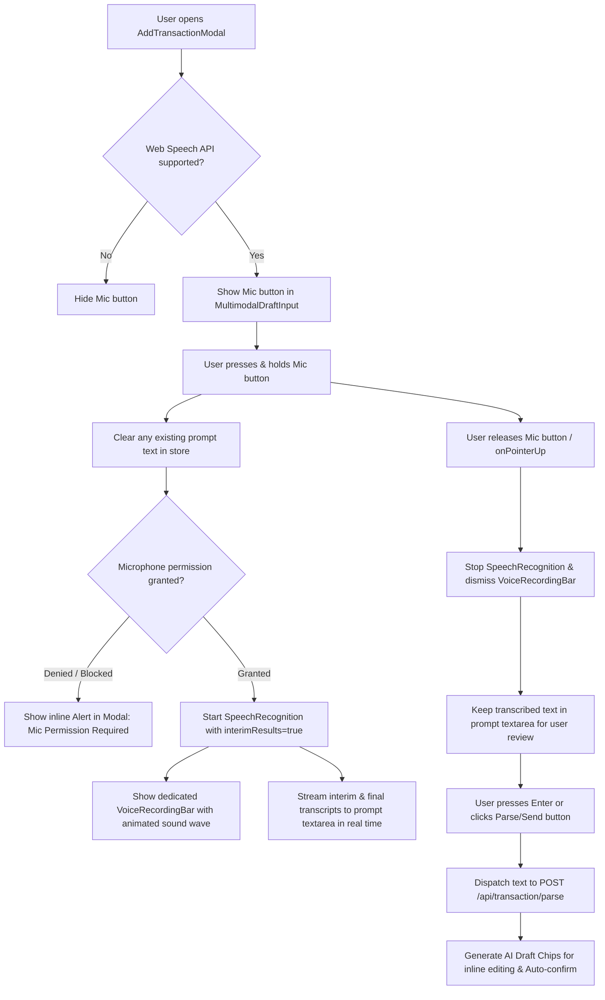

# Software Design Document (SDD): Voice Transaction Input

**Document Version:** 1.0.0  
**Status:** Approved for Implementation  
**Target Milestone:** Voice Input Feature (Complement to AI Draft Transaction Pipeline)  
**Related Specs:** `sdd/ai-draft-transaction-pipeline.md`, `sdd/ux-redesing-v2.md`, `sdd/heroui-v3-migration.md`  
**Reference Component:** `src/components/features/Transactions/AddTransactionModal/`  

---

## 1. Executive Summary & Objective

The **Voice Transaction Input** feature extends Zolvent's natural-language **AI Draft Transaction Pipeline** by enabling hands-free, high-speed audio transaction drafting via the browser's native **Web Speech API (`SpeechRecognition` / `webkitSpeechRecognition`)**. 

Guided by the project's core mission to provide **low-cost personal finance management for everyone**, this architecture relies entirely on client-side native browser capabilities—incurring **zero third-party subscription fees, zero server-side audio processing compute costs, and zero additional runtime bundle dependencies**.

### Core Goals & Principles
1. **Zero-Cost & Lightweight:** Use native Web Speech API directly via a custom React 19 hook (`useSpeechRecognition`) rather than heavy legacy npm packages.
2. **Push-to-Talk (Press-and-Hold) Interaction:** User holds the Mic button to speak and releases to finish, preventing unintended microphone eavesdropping and background noise recording.
3. **Auto-Clear on New Recording:** Holding down the mic button when the textarea already contains text automatically clears the previous text before starting the new recording session.
4. **Live Streaming Transcript:** Real-time speech-to-text feedback updates the prompt textarea dynamically with interim and final transcripts.
5. **Dedicated Voice Feedback Bar:** Active recording activates a dedicated visual wave / pulsing voice indicator inside the input area.
6. **Review Before Parse (Manual Submit):** After releasing the mic button, the transcribed text stays in the prompt textarea for user review/editing, requiring an explicit Enter key press or Send/Submit click before dispatching to `POST /api/transaction/parse`.
7. **Graceful Browser Degradation:** The Mic button automatically hides on unsupported browsers (e.g. desktop Firefox).
8. **Actionable Permission Handling:** Clear inline Alert banners inside `AddTransactionModal` when microphone permissions are denied or blocked.
9. **Locale Strategy:** Default to `'es-ES'` with fallback to `navigator.language`, structured for future user settings preferences.

---

## 2. User Experience & Interaction Design

### 2.1 Visual States & Layout

```
┌─────────────────────────────────────────────────────────────┐
│ MOBILE / DESKTOP MODAL INPUT AREA                           │
│                                                             │
│ 1. IDLE STATE                                               │
│ ┌─────────────────────────────────────────────────────────┐ │
│ │ Type or speak... e.g. "Spent 45 on groceries with Chase"│ │
│ │                                           [ 🎤 ] [ 📷 ] │ │
│ └─────────────────────────────────────────────────────────┘ │
│                                                             │
│ 2. RECORDING STATE (Press & Hold Mic Button -> Clears Text) │
│ ┌─────────────────────────────────────────────────────────┐ │
│ │ Spent 45 on groceries with Ch_                          │ │
│ │ ┌─────────────────────────────────────────────────────┐ │ │
│ │ │ 🔴 Listening...  ılı.lı.llı (Wave)         [Holding] │ │ │
│ │ └─────────────────────────────────────────────────────┘ │ │
│ └─────────────────────────────────────────────────────────┘ │
│                                                             │
│ 3. TRANSCRIBED / REVIEW STATE (Mic Released)                │
│ ┌─────────────────────────────────────────────────────────┐ │
│ │ Spent 45 on groceries with Chase                        │ │
│ │                                    [ 🎤 ] [ 📷 ] [ ↵ ]  │ │
│ └─────────────────────────────────────────────────────────┘ │
│                                                             │
│ 4. PARSING / AI DRAFT STATE                                 │
│ ┌─────────────────────────────────────────────────────────┐ │
│ │ ✨ Extracting transaction details...                     │ │
│ └─────────────────────────────────────────────────────────┘ │
└─────────────────────────────────────────────────────────────┘
```

### 2.2 Interaction Flowchart



### 2.3 Gesture & Device Support
- **Touch & Pointer Events:** Uses `onPointerDown` and `onPointerUp`/`onPointerLeave` (with touch-action prevention) to support mobile touchscreens, trackpads, and mouse clicks seamlessly.
- **Haptic Feedback:** Triggers a subtle haptic tap on mobile devices (`navigator.vibrate?.(40)`) on recording start and stop when available.
- **Visual Feedback:** 
  - Mic button turns into an active pulsing state with danger/accent glow when active.
  - Dedicated `VoiceRecordingBar` displays an animated sound wave and live status indicator.

---

## 3. Architecture & Technical Design

### 3.1 Web Speech API Architecture

The Web Speech API's `SpeechRecognition` (prefixed as `webkitSpeechRecognition` on Safari and Chromium) provides asynchronous speech transcription.

```
┌───────────────────────────────────────────────────────────────┐
│ Browser Client (Next.js 16 / React 19 Client Component)       │
│                                                               │
│  ┌───────────────────────────┐   events    ┌────────────────┐ │
│  │ useSpeechRecognition Hook  │ <--------> │ Web Speech API │ │
│  └─────────────┬─────────────┘             │ SpeechRecogni- │ │
│                │ updates                   │ tion Engine    │ │
│                ▼                           └────────────────┘ │
│  ┌───────────────────────────┐                                │
│  │ useTransactionDraftStore  │                                │
│  └─────────────┬─────────────┘                                │
│                │                                              │
│                ▼                                              │
│  ┌───────────────────────────┐             ┌────────────────┐ │
│  │ MultimodalDraftInput      │ --(submit)->│ POST /api/     │ │
│  │ + VoiceRecordingBar       │             │ transaction/   │ │
│  └───────────────────────────┘             │ parse (GenAI)  │ │
│                                            └────────────────┘ │
└───────────────────────────────────────────────────────────────┘
```

### 3.2 Custom Hook: `useSpeechRecognition`

The hook encapsulates Web Speech API instantiation, browser compatibility checks, event bindings, and transcript state. Following repository conventions, naming uses the `Props` suffix.

```typescript
export interface UseSpeechRecognitionProps {
  lang?: string;
  onTranscriptChange?: (transcript: string) => void;
  onError?: (error: SpeechRecognitionErrorEvent) => void;
}

export interface UseSpeechRecognitionReturn {
  isSupported: boolean;
  isListening: boolean;
  transcript: string;
  interimTranscript: string;
  finalTranscript: string;
  permissionError: string | null;
  startListening: () => void;
  stopListening: () => void;
  resetTranscript: () => void;
}
```

#### Key Implementation Logic:
1. **Window / Prefix Detection:** Safely check `typeof window !== "undefined"` and identify `window.SpeechRecognition || window.webkitSpeechRecognition`.
2. **Configuration:**
   - `continuous = true`
   - `interimResults = true`
   - `lang = DEFAULT_SPEECH_LANGUAGE || (typeof navigator !== "undefined" ? navigator.language : "es-ES")` (where `DEFAULT_SPEECH_LANGUAGE = "es-ES"`)
3. **Event Listeners:**
   - `onresult`: Concatenate final transcript parts and track real-time interim results.
   - `onerror`: Capture `not-allowed`, `no-speech`, `audio-capture` and set user-friendly error messages.
   - `onend`: Safely synchronize `isListening` state.

---

## 4. Component Structure & Changes

### 4.1 New & Modified Files

| File | Purpose | Action |
|---|---|---|
| `src/config/env.ts` | Speech recognition default configuration (`Env.DEFAULT_SPEECH_LANGUAGE = "es-ES"`) | **[MODIFY]** |
| `src/hooks/useSpeechRecognition.ts` | Custom React 19 hook for Web Speech API integration (`UseSpeechRecognitionProps`) | **[NEW]** |
| `src/components/features/Transactions/AddTransactionModal/VoiceRecordingBar.tsx` | Visual wave / listening indicator bar (`VoiceRecordingBarProps`) | **[NEW]** |
| `src/components/features/Transactions/AddTransactionModal/MultimodalDraftInput.tsx` | Add Mic push-to-talk button, voice recording bar, and submit trigger | **[MODIFY]** |
| `src/components/features/Transactions/AddTransactionModal/AddTransactionModal.tsx` | Add inline alert display for microphone permission errors | **[MODIFY]** |
| `src/i18n/locales/en/transactions.json` | English localization keys for voice input | **[MODIFY]** |
| `src/i18n/locales/es/transactions.json` | Spanish localization keys for voice input | **[MODIFY]** |

---

## 5. UI/UX & Theming Specifications

Following Zolvent's Design Rules (no hardcoded Tailwind palette colors; semantic tokens only):

- **Mic Button (Idle):**
  - `<Button variant="secondary" isIconOnly aria-label={t("aiDraft.voiceTrigger")}>`
  - Icon: `HiOutlineMicrophone` (`text-foreground / text-muted`)
- **Mic Button (Active / Pressing):**
  - `bg-danger/20 border-danger text-danger scale-105 transition-transform animate-pulse`
  - Icon: `HiMicrophone`
- **VoiceRecordingBar Container:**
  - `flex items-center justify-between gap-3 px-3 py-2 rounded-xl bg-surface-secondary border border-border text-xs`
- **Sound Wave Indicator:**
  - 4-5 animated vertical bars styled with `bg-accent rounded-full` using CSS keyframe animations (`wave-pulse`).
- **Submit / Send Button (When text present):**
  - `<Button variant="primary" isIconOnly size="sm" aria-label={t("aiDraft.submitPrompt")}>`
  - Icon: `HiArrowUp` or `HiPaperAirplane`
- **Permission Denied Alert:**
  - HeroUI `<Alert status="warning"><Alert.Indicator/><Alert.Content><Alert.Description>{t("aiDraft.micPermissionDenied")}</Alert.Description></Alert.Content></Alert>`

---

## 6. Internationalization (i18n)

### 6.1 English (`en/transactions.json`)
```json
{
  "aiDraft": {
    "voiceTrigger": "Hold to speak transaction details",
    "voiceListening": "Listening... Keep holding to speak",
    "voiceReleaseToFinish": "Release to finish",
    "micPermissionDenied": "Microphone access was denied. Please allow microphone permissions in your browser settings to use voice input.",
    "submitPrompt": "Parse transaction details"
  }
}
```

### 6.2 Spanish (`es/transactions.json`)
```json
{
  "aiDraft": {
    "voiceTrigger": "Mantén presionado para hablar",
    "voiceListening": "Escuchando... Mantén presionado mientras hablas",
    "voiceReleaseToFinish": "Suelta para terminar",
    "micPermissionDenied": "El acceso al micrófono fue denegado. Habilita los permisos de micrófono en la configuración de tu navegador para usar la entrada por voz.",
    "submitPrompt": "Procesar detalles de la transacción"
  }
}
```

---

## 7. Security, Privacy & Performance

1. **Client-Side Processing:** The Web Speech API performs speech-to-text directly on-device or via the browser's native platform engine. Zolvent transmits only the resulting plain text string to the backend AI parser.
2. **Ephemeral Audio:** No audio recordings or binary audio blobs are stored locally or uploaded to Zolvent servers.
3. **Zero Bundle Impact:** No extra npm dependencies (e.g. `react-speech-recognition`, `regenerator-runtime`, `@babel/polyfill`).
4. **Offline Awareness:** Respects Zolvent's existing offline guard (`useOnlineStatus` / `useOfflineWriteGuard`). If offline, voice transcription and AI parsing are gracefully disabled.

---

## 8. Verification Plan (Manual)

### 8.1 Manual Verification Matrix
- **Desktop Chrome / Edge / Brave:** Test push-to-talk with Spanish and English phrases. Verify existing text clears upon pressing the mic button, live transcript streams smoothly, and manual submission to GenAI parser generates transaction draft chips.
- **Mobile Safari (iOS PWA / Web):** Test touch press-and-hold gestures and haptic feedback.
- **Desktop Firefox:** Verify Mic button is cleanly hidden without throwing errors.
- **Microphone Permission Denied:** Verify inline warning alert displays inside `AddTransactionModal` without breaking the app.

